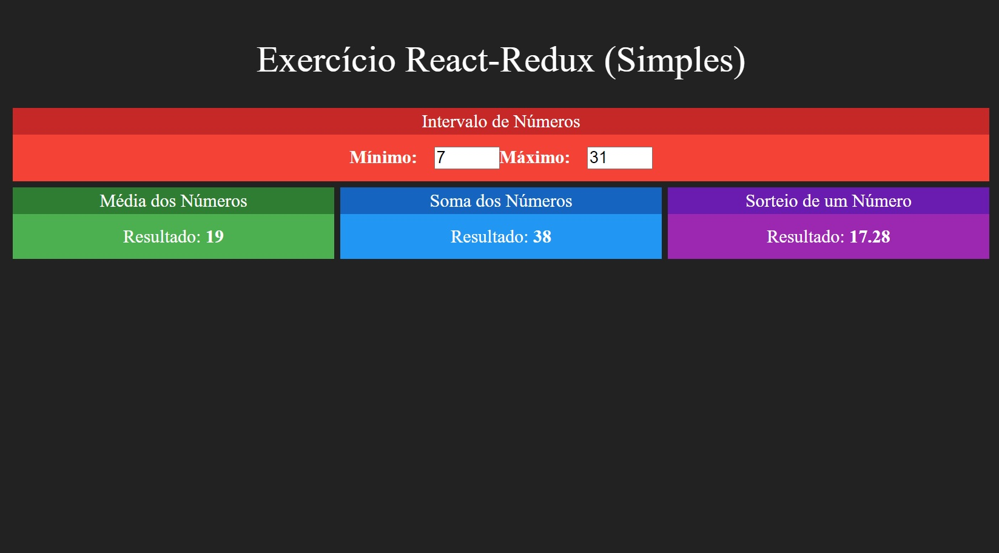

<h4 align="center"> 
	🚧 React Redux 🚀
</h4>   

 
    

 

## 🚀 Projeto

Introdução do redux para gerenciamento de estados.

## 💻 Tecnologias

- [x] 1. Html, css, javascript
- [x] 2. ReactJs, Redux

## 🚀 Inicializar o projeto 

Create the app in the development mode: `npx create-react-app react-redux`:  

Runs the app in the development mode: `npm start`:  
Open [http://localhost:3000](http://localhost:3000) to view it in the browser. 

## 📝 Licença

Este projeto esta sobe a licença MIT.

Feito com ❤️ por Douglas A B Novato 👋🏽 [Entre em contato!](https://www.linkedin.com/in/douglasabnovato/)
 
Fonte do projeto Por Leonardo Moura Leitão no [Curso React + Redux: Fundamentos e 2 Apps do Absoluto ZERO!](https://www.udemy.com/course/react-redux-pt/), [Cod3r](https://www.cod3r.com.br/), [Github Cod3r](https://github.com/cod3rcursos/curso-react-redux)
